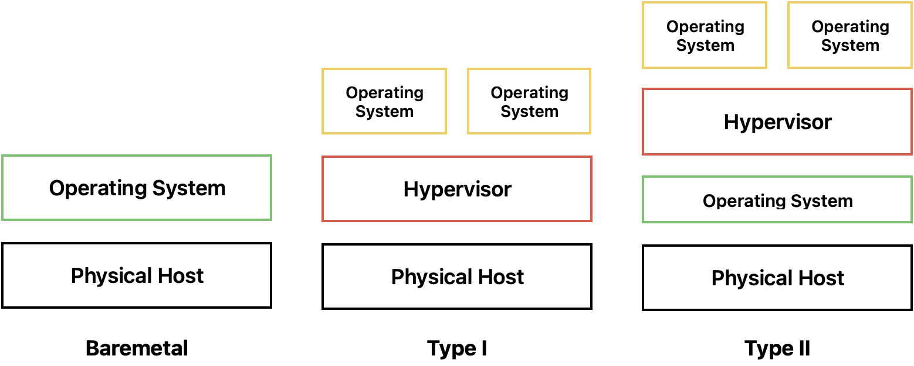
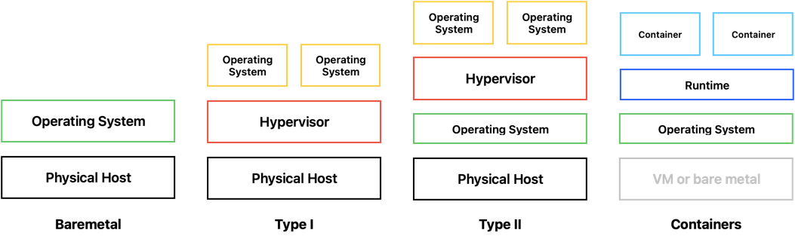
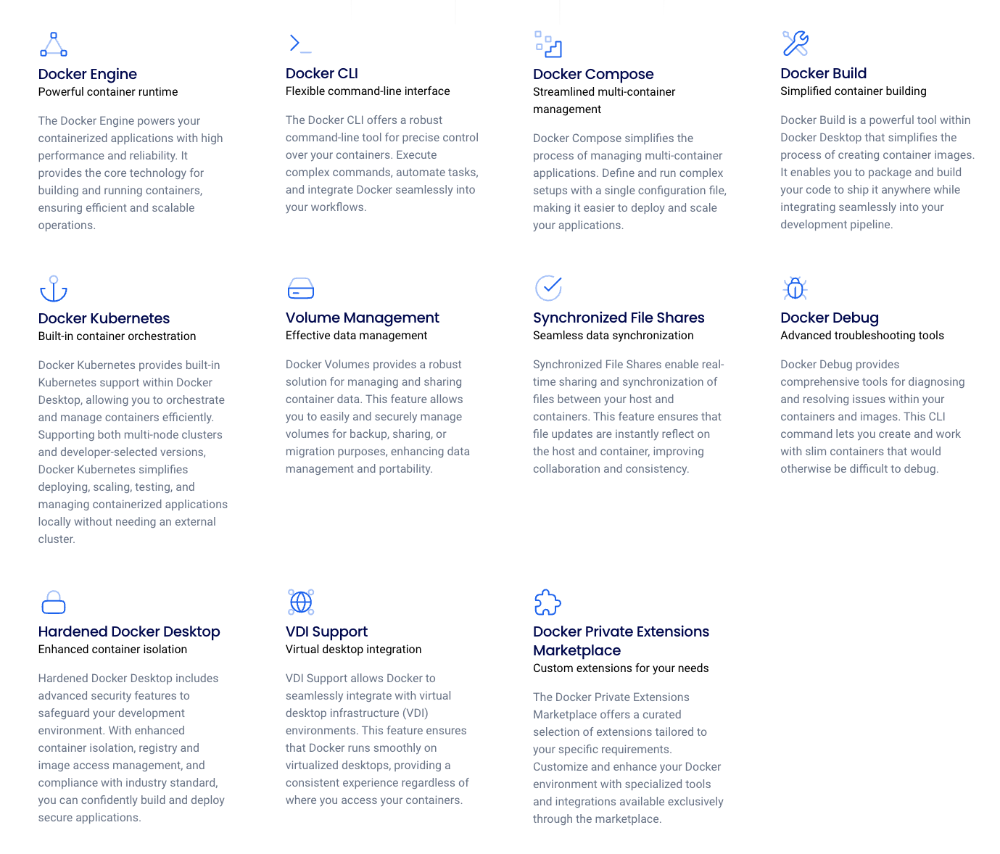

# Beyond Docker

This lesson aims to broaden the perspective of emerging students having just learned about `docker` or similar techniques. While some of the following foundations are out of scope for the level of students this is for, having heard of the topics will hopefully help you to understand the applications and order your current knowledge of containerization.

### Prerequisites

This script assumes you have a general understanding of how to interact with **Docker** specifically. It also assumes that a very basic understanding of **Operating Systems** and **Virtualization** is established.

You should have at least heard of the following:
- Docker - `docker run|build|exec` and `docker compose`
- Linux - What are processes, what's the file structure of a typical distribution
- Virtualization - What are VMs, how are they used

---
## Containerization under the hood

Although most of this chapter is definitely out of scope, it is very interesting to generally see what is happening when you start a container with commands like `docker run ...`.
Before diving in, do understand that these topics are highly specialized and most senior developers out there will not know this or at least the details on this either.

### Control groups and namespaces

Containers used by **Docker** or similar software can be compared with virtual machines and often are. As you should know about basics of virtual machines already, here is a very broad overview on how they compare to bare metal installs and containers.

#### Bare Metal

Bare metal installs are running on most of regular personal computers like gaming PCs or Laptops. These installs are loaded into system memory on start of the hardware and have direct access to the hardware beneath.


#### Virtual Machines

Virtual Machines (VMs) in turn are generally not directly accessing the hardware but are rather hosted by a so called *hypervisor*. This hypervisor can either run directly on the physical machine (Type I / Machine Level) or on the operating system installed on the machine (Type II / OS Level).

In both cases this hypervisor emulates real hardware to the VM so that the VM itself is not necessarily aware of being virtualized. Software like **KVM** and **QEMU** take care of *mocking* (KVM) and managing (QEMU) resources on the physical machine.

The important note in the context of comparing VMs to containers is, that VMs have access to some sort of virtualized hardware. In Linux terms these VMs bring their own Kernel and get virtualized access to resources like the CPU and Memory.



#### Containers

In simple terms, containers differ from virtual machines, as they share the Kernel with the operating system they run on. This means - in very simple terms, that containers are simple processes running on the hosts kernel in an isolated manner.



This is the reason why containers are much more resource efficient as VMs, 
there is no need to virtualize actual hardware for the container to use, 
the Linux kernel handles the containers like processes and schedules them accordingly, 
managing memory and filesystem changes accordingly.

The difference can very easily be seen by inspecting the processes on a linux system.
On a Linux system emulating virtual machines (via KVM, like Proxmox) run:

```bash
ps aux | grep kvm
```

On a Linux system running a container, run:

```bash
docker run -dit --name alpine alpine:latest /bin/ash
ps -fp $(docker inspect -f '{{.State.Pid}}' alpine)
```

In turn, if you check all running processes in the container, you will also see only one running (excluding the `grep` command), which is likely also the process with the ID `1`:

```bash
docker exec -it alpine ps aux
```

We see this container is running a shell, which we wanted it to do by running the container with the flags `-it`.

##### rootfs

Notice we explicitly asked docker to run the interactive shell `/bin/ash`, which is `alpine` - Linux's default shell. This shell is usually not installed on other distributions like `ubuntu` or `rhel`. So where does this binary come from? Let's see...

```bash
ROOT_FS=$(docker inspect $(docker ps -q --filter "name=alpine") | jq '.[0].GraphDriver.Data.MergedDir' | sed 's/"//g' )
```

*Note: The inner command only finds the container ID, `jq` is a JSON tool to inspect the output of `docker inspect`, `sed` removes the double quotes from the JSON output.*

This command will give you the so called `rootfs` of your container.
We can check it out by simply listing all its content or simply check wether `ash` is actually a binary inside the container:

```bash
sudo ls $ROOT_FS/bin | grep ash
```

##### Namespaces

On a very high level, namespaces in Linux are simply borders in which processes operate. They isolate different resources a process can access. Containers are supposed be be isolated from the rest of the system, but in general processes can interact with each other. Namespaces offer virtual environments which isolate processes and resources inside the namespace from the ones in others or outside that namespace.
To see the namespace of our docker process, let's check the hosts filesystem under `/proc`.

```bash
ls -l /proc/$(docker inspect --format '{{.State.Pid}}' alpine)/ns
```

In the example of process (PID) namespaces we can see in out example that multiple processes can have the same ID, as long as they are in different namespaces.
Therefore the process with ID `1` inside our container running `/bin/ash` is isolated from our host systems process with the ID `1` which very likely runs `/sbin/init`.

##### Control Groups

While namespaces give the operating system the ability to separate processes and other resources, control groups (or `cgroups`) manage the resource limits for any given process in that control group.
Let's see in which `cgroup` our container is:

```bash
sudo cat /proc/$(docker inspect --format '{{.State.Pid}}' alpine)/cgroup

# 0::/system.slice/docker-589c53b502a921e248da730361493f25d00e2a26be7abf1925048844106a8f47.scope
```

The output (much like file-paths) offers a control group hierarchy.

- `0::`: root `cgroup`
- `system.slice`: Broadly speaking this handles processes started by `systemd`
- `docker-589c53b502....scope`: The container specific `cgroup`

This hierarchy allows different actors to set limits to the resources a process gets. `Systemd`can for instance limit resources given to the `docker.daemon`, whereas Docker can limit resources (in its given bound by `systemd`) to each container.
### Levels of control

As the previous chapters have explained running containers does involve some level of complexity. From creating `cgroups` for resource management and `namespaces` for process interaction, over starting and stopping containers from image manifests, to pulling images from the registry and giving the user access to a graphical interface to manage his workloads, Docker combines several packages to achieve its purposes.

#### Runtimes

Managing the Kernel level (`cgroups`and `namespaces`) features is done by a so called *runtime*. There are broadly speaking 2 types of runtimes - **low** level and **high** level.
##### Low Level

Low level runtime implementations (like `runc` in Docker) manage direct Kernel level features as mentioned above. However starting processes in their own namespace with custom control groups is not quite user friendly. Low level runtimes do typically not provide features like container management, pulling images, etc.

##### High Level

High Level runtimes (like `containerd` in Docker) call low level runtimes like `runc` for managing Kernel level features while themselves handling containers and pulling images. They provide a new level of abstraction, are usually still only command line based and therefore less user friendly.

#### Interface

For users to interact with the runtimes more easily, there are multiple interfaces available, in case of Docker it is the **Docker CLI**. This gives programmatic access to the features and provides the interaction with the **Docker Dashboard** some are probably familiar with.
The Docker Distribution specifically comes with a service called the **Docker Daemon** which in turn handles all communication with the runtimes.

==Images needed==
### MacOS and Windows

It is important to emphasize that the methods of process isolation and resource management mentioned above is **only** applicable to Linux distributions running containers. This means for MacOS and Windows there is no comparable option.
This - among other reasons - lies in the focus and willingness of the OS owners Apple and Microsoft to implement alternatives to this.
As standardization and the willingness of Linux Kernel maintainers to implement features for isolation and resource management were fast to emerge after the initial concepts of containers were implemented, other major OSs mostly rely on some sort of virtualization of the Linux Kernel to provide the features needed for containers to run.

---
## Open Container Initiative

==Maybe move after alternatives==

*The [Open Container Initiative](https://opencontainers.org/) (OCI) is an open governance structure for the express purpose of creating open industry standards around container formats and runtimes.*  - OCI, https://opencontainers.org/about/overview/

In other words, the OCI sets standards for how images are defined (image-spec), how they are run ([runtime-spec](https://opencontainers.org/release-notices/v1-2-0-runtime-spec/)) and lately also for how they are distributed ([distribution-spec](https://opencontainers.org/release-notices/v1-1-1-distribution-spec/)).
### Why is this important?

As more and more alternatives to Docker emerged (Podman, Kata, LXC) and containers became more and more adapted (Kubernetes, OpenShift, Serverless) it became very important to define a standard which framework could either actively implement to ensure interoperability or actively divert from to provide an option.

Nowadays OCI plays a major role in interoperability of tools. In result of its existence we are now able to build containers in **Podman**, **Docker**, **Buildah** etc. and run them with either **Docker**, **Podman**, **Kubernetes**, **OpenShift** etc. without needing to change anything.

---
## Beyond Docker

As mentioned earlier there are alternatives to Docker, especially after the establishment of the OCI standards. But what exactly is Docker then? A runtime? Management?

### What exactly is Docker (Engine)?

According to Dockers own website the name **Docker** is simply a wrapper name for the products it combines. These products are the ones Docker promote on their website (https://www.docker.com/products/docker-desktop/, accessed 20.03.2025, 16:28).



Some of these products most of us will probably never actually use - like for example **VDI Support** or **Hardened Docker Desktop**, so lets look at the major products that define the name Docker.

- **Docker Engine:**
  This is the key software component that actually manages running containers, accessing the runtime and interacting with the operating system. Typically this is done by combining runtimes, in Dockers case these are `containerd` and `runc`. However this does not yet include any user interaction. The `dockerd` Daemon takes care of this and the CLI.
- **Docker CLI:**
  Is a command line interface for using the docker engine and usually ships with the Docker Daemon.
- **Docker Compose:**
  Originated as optional plugin and is now shipped by default. This handles more complex container orchestration on a single node. Not to confuse with orchestration in Swarm mode.
- **Volume Management:**
  This is simply put the management of volume mounts to the namespace of the processes run.
- **Docker Debug:**
  A newer feature by Docker for debugging container builds and lifecycle management via the CLI.

### Alternatives to Docker

As Docker has to some point become the default naming for anything close to containers, it is important to know that there are lots of alternatives these days, especially after the unification by the OCI. The following list is a very short excerpt showing some alternatives in the general approach to containers.

#### Podman

Red Hat offers its product [Podman](https://podman.io/) as closest alternative to Docker on developers machines. The main difference to Docker is the lack of a daemon running to manage the containers and access the runtime. Podman (as CLI tool and as UI Dashboard) is able to use the low level runtimes `runc` and [`crun`](https://github.com/containers/crun) (A `runc` alternative written in `C`) directly, ommiting the need for a higher level runtime like `containerd`. Both Docker and Podman are OCI compatible.

The main benefit of this is that Podman can run containers as child processes of the user, without needing `root` privileges like Docker needs. This also allows user to run containers from inside containers, which is not (easily) possible with Docker.

Another key difference is the approach Podman takes, which is the approach of *Pods*. A pod is defined as a logical unit, not as a single container. Pods usually only need one container but can consist of more. This is very similar to the approach more complex systems like **Kubernetes** use.

Podman is mostly Docker CLI and even `compose` compatible though for easy adaption. I can only encourage you to give it a try.

#### Linux Containers

[Linux Containers](https://linuxcontainers.org/) (LXC) are an approach similar to OCI containers as in that they are lightweight processes with generally no virtualization needed. However the key difference is that LXC containers are meant to be lightweight full systems which can run multiple services, whereas OCI containers are truly only meant to run a single process and one application.

LXC containers generally act like lightweight VMs, even though they are very different under the hood. This makes them very much usable though for virtualization purposes if the running services don't need actual hardware features.

One keys difference of LXC to OCI is also that LXC can run as `root` on the host system per default, which OCI images generally do not.
Per definition LXC containers are file based (`rootfs`) and mutable, whereas OCI containers are declarative and loose state when stopped (and not persisted as volume).

#### Kata Containers

[Kata Containers](https://katacontainers.io/) are the result of the need to isolate containers even more than through namespaces and control groups only. As there are potential attack possibilities when using true containers as processes, this approach is not feasible in a industry environment where a cloud provider offer container hosting for multiple users.

Kata Containers use MicroVMs to truly isolate the containers from others running on the same system. MicroVMs are very small virtual machines with there own optimized kernel to truly isolate the processes. The operating systems used are usually very lightweight and optimized for fast boot times in the milliseconds range.
### Escalating  container usage

As the later chapters will be more practical and advancing in complexity this chapter is aimed to give you a basic understanding of the multiple escalations of container usage.

#### Simple Containers

If you simply want to test an application or run it isolated, simple containers are your go to solution. You will need to build, run and stop them individually, which makes running more than one container simultaneously very tedious.

#### Docker compose

This is where `compose` comes to help you. Compose is strictly speaking a Docker exclusive feature (even though Podman is mostly compatible). It takes the complexity of building, running, managing, stopping and destroying multiple containers, volumes and networks from the user by defining everything in a single `compose.yml` file. This is great if you want to test complex systems locally. It however cannot manage containers running on multiple physical nodes.

#### Docker Swarm

This is where Dockers [Swarm Mode](https://docs.docker.com/engine/swarm/) comes into play. It enables you to run and manage multiple containers over multiple physical nodes, allowing you to enable true redundancy, as it can distribute a single workload over multiple nodes, whereas `compose` can only start multiple instances of one container to load-balance.
This is however not necessarily the best approach for production environments as it on one hand limits you to Docker functionality and it only supports internal service discovery, load-balancing and manual scaling.

#### Orchestration

If you need a robust system with all the bells and whistles regarding networking, scaling, load balancing etc. you will need to fall back to more complex but capable products like [Kubernetes](https://kubernetes.io/) and [OpenShift](https://www.redhat.com/en/technologies/cloud-computing/openshift). Whereas Kubernetes started at Google, OpenShift is the competitive answer by RedHat, aiming for a more robust enterprise based solution with advanced automation and underlying RedHat products by default.

These products allow you to host very complex multi node and even multi cluster container environments with advanced features for persistence, networking, availability, auto-scaling and more.

---
## Applications

The following chapter will give you some ideas of what containers can be used for. Keep in mind that containers are very versatile and the coming chapter is only an excerpt of what is possible.

We will focus on 3 general fields of application, locally as a developer or user, remote as tools for automations and hosting and finally the usage in an enterprise hyperscaler-like (AWS, Google Cloud, Azure) environment.
### Locally

Assuming you already have the knowledge listed in the prerequisites, you will know the local options for container usage the most already. I would argue that local usages of containers mainly are designed for making the lives of developers easier. The following 3 options are - what I would consider - a typical programmers best friend.

#### Test software

Imagine you have a new set of software which you would really like to use, but you are not sure yet. Maybe the initial setup is quite cumbersome to run on your machine or any other machine. This is where Docker can help you to test whether the software actually meets your demands without actually installing it.

Take for instance databases, you need to run a project and now you are debating whether you need a SQL solution like [Postgres](https://www.postgresql.org/) or rather something document based like [MongoDB](https://www.mongodb.com/). No problem, just try them locally!

```bash
docker run --rm -itd --name test-postgres -e POSTGRES_PASSWORD=password postgres:alpine
# then connect
docker exec -it test-postgres psql -U postgres
# then check
SELECT datname FROM pg_database;
exit
```

And for **MongoDB:**

```bash
docker run --rm -itd --name test-mongo mongo:latest
# then connect
docker exec -it test-mongo mongosh
# then check
show dbs
exit
```

If you are done, no need to keep them, just run:

```bash
docker container rm -f test-postgres test-mongo
```
#### No local installs

Most programmers will have multiple software installations present on their machine. Assuming you work on a full stack project, you might need to install database drivers, Java runtimes, Python environments, NodeJS and multiple more. It gets even worse if you are working on multiple projects simultaneously, as they might share the stack used to some degree, but require other versions that might be incompatible. This gets even worse if your requirements themselves have multiple requirements, which have requirements themselves, and so on.
There are definitely workarounds, Python has virtual environments (`python -m venv`), NodeJS has the [Node Version Manager](https://github.com/nvm-sh/nvm) (`nvm use 20`), but not all languages feature this. Not to mention that this **permanently** needs disk space per project.

This is where we can use `docker run` to our advantage. Remember Docker has its own suite of executable shipped with the `rootfs`, which could include things like NodeJS or Python.
Let's try this with the example of running a simple python command.

```bash
docker run --rm python:alpine python -c 'print("Hello World!")'
```

Obviously this can get more and more complex, assuming you have an actual project you wanted to run, you can simply map the project files as volumes and add something like the following to your `.bashrc` (Assuming your shell is `bash`):

```bash
# add this
alias python='docker run --rm -v "$(pwd)":/app -w /app python:alpine python'
# use like this
python my_script.py
```

Obviously projects and requirements are mostly more complex, but you can adjust this as needed or simply run `docker run` manually. You also have the option to run a specific `Dockerfile`for your needs this way.

Coming back to the downside of virtual environments needing disk space; Sure Docker needs space for the images, but deleting them won't matter as much, because Docker will simply download the image again if it is missing. Doing this with every virtual environment is more tedious and work intense.

If you want to use this more advanced, consider using containers to compile and build your final products. For reference see the project https://github.com/noahlehmann/talk-daily-automations, more specifically the `slides` folder. This project uses a `Containerfile` to build the slides written in [LaTeX](https://www.latex-project.org/), which otherwise would need a complex local installation.

#### Local Environments

Assuming you have already heard the topics in the prerequisites, you should also have heard of `docker compose`, a very rich tool to orchestrate containers locally, providing networking, communication, build automation, volume handling and even more. If you take this very seriously (which you definitely should) you could mimic any real world deployment scenario with this. This enables you to test any given project locally, as long as all its components can be run in a container.

See https://github.com/noahlehmann/talk-daily-automations for a working compose project with a database, webpage and an API.

**Bonus**

Working locally always means exposing ports for network services in your compose, however sometimes this brings problems with routing, [CORS](https://developer.mozilla.org/de/docs/Web/HTTP/Guides/CORS) or security features (e.g. [OICD](https://openid.net/developers/how-connect-works/)). Specifically - in some cases - providing `localhost` as domain name might result in unexpected behaviour.
Remember that each container has its own namespaces, also for resources like networking. The same applies to all services in compose. So calling `localhost` from inside a container is going to point to that container again, not to the host machine the container runs on.
The solution is quite simple and genius, the explanation for this out of scope though. Some good souls have bought Domains like `localdev.me` and pointed their DNS entries to the `localhost`entries and IPs.

Full explanation here: https://codeengineered.com/blog/2022/localdev-me/

#### Devcontainers

Devcontainers originally started to be developed in the **VSCode** realm, however now they get adopted in other major IDEs like all Jetbrains IDEs.

Developer Containers ([devcontainers](https://containers.dev/)) are taking local environments to the next level. You have a lot more control of your container as you can define it by providing a custom `Dockerfile`. This means you can add **ALL** your projects dependencies to it, configure the container so that you project setup runs in it seamlessly and distribute this container in your project as `.devcontainer/` folder. This allows instant and seamless onboarding for new developers on a project.

A second upside of devcontainers is the option to run them remotely, freeing up resources on your personal work machine and adding capabilities like GPUs and more file storage.

Looking back at all the usages from above, .devcontainers can technically do all of the examples above (The only hurdle to master is DinD - Docker in Docker, but running containers in containers is possible as well, see later chapters).

See the project https://github.com/noahlehmann/talk-daily-automations for a working example.

### Remote

Once you have reached your full potential as a local developer and want to move things to production, hosting services on your personal laptop will no longer be a feasible option. This is where containers can do the heavy lifting in automating your workflow; from building over testing  to deploying.
#### CI/CD

Continuous Integration & Continuous Deployment (CI/CD) is a term more and more prominent in software development and DevOps especially. In simple terms, CI/CD describes the practice of integrating changes to software as they become production ready and automating the build, distribution and deployment of these changes to running systems.

As you can imagine, if you can build and run software in containers locally, you can definitely do this remotely and automated as well. The following chapters show some providers that offer solutions for this.
##### Github Actions

*It is important to know beforehand, that not all features of Actions are implemented with containers, more OS specific solutions also use virtualization.*

Chances are, if a project is hosted on Github, it is also automated with [Github Actions](https://github.com/features/actions) to some degree, be it code quality checks, tests, builds and distribution/ deployment. And setting this up is stupidly easy, simply add your workflows to your code base.

```bash
mkdir -p .github/workflows
```

Then add your workflows as [YAML](https://yaml.org/) definitions and you are good to go! See the project https://github.com/noahlehmann/talk-daily-automations for reference. It uses Actions to test the project, build and publish the container images needed and to build and deploy the slides written in LaTeX as PDF to Github Pages.
##### Gitlab CI/CD

*Same as Github Actions, Gitlab offers multiple ways to run its jobs, one (quite convenient) option is Docker though.*

==TODO==
##### Alternatives

Where there's a will (and a creative developer), there's a way. Meaning: If you need a custom solution because you neither use Github nor Gitlab or your needs exceed their features, you can use dedicated CI/CD products like (among so many others) [Jenkins](https://www.jenkins.io/) or [ArgoCD](https://argo-cd.readthedocs.io/en/stable/). Bonus points: Some CI/CD tools like ArgoCD are even Kubernetes native, meaning they themselves run highly available in a container orchestration environment. Standalone tools like Jenkins on the other hand don't necessarily need containers to build things, but you can definitely integrate containers into your workflows.

#### Cloud Native AI and Data Science

If you have (or will in the future) have ever used services like [Jupyterhub](https://jupyter.org/hub) or [Google Colab](https://colab.google/) (uses Jupyter under the hood) to run your python experiments for data analysis or machine learning, you most likely have been using containers all along. These notebook like environment help you write your experiments in a step by step fashion without the need to have one working script or project. They offer simple to use environments with preinstalled Python runtimes and sometimes even with integrated GPUs or TPUs.

The Jupyter Environment hosted at Hof University ([KI-AWZ](https://jupyterhub.ki-awz.iisys.de/)) is 100% container based and hosted in Kubernetes, integrating multiple choices for runtimes and GPUs seamlessly for every student and staff member to use free of charge. This service is limited to users with access to Hof University SSO unfortunately.

### Hyperscale

At some point any non static application will need to grow its infrastructure to an enterprise level. Historically that meant buying actual hardware, connecting it to the ISP, installing one application per physical node and if necessary buy more hardware to scale. This is obviously quite inefficient as you would never be able to perfectly (or close enough to it) use all that hardware. It is very likely it would be idling more than wanted. Scaling really isn't an option, except if you had enough money to buy hardware to handle usage peaks and leave it off or idling traffic is low. Now some of these downsides have been mitigated by rather using VMs on physical hosts, as usage gets better and redundancy can be multiplied. The move to the cloud helped even more, because now each business doesn't need to buy hardware, you simply rent as you go. But as we have learned, VMs are a lot more resource hungry than containers. With containers, we can now step the outsourcing up even more. In a perfect case, we now have VMs running on generalized hardware, which in turn only host containers, giving us peak control over the systems and their usages. Move all of this to the cloud and you can call this a hyperscale solution.

Hyperscaling is simply a term to amplify usage to higher levels than most enterprises would need. Examples for hyperscalers are [AWS](https://aws.amazon.com/de/), [Google Cloud](https://cloud.google.com/?hl=de) or [Azure](https://azure.microsoft.com/de-de). In Europe we have alternatives like [Hetzner](https://www.hetzner.com/de/), [Telekom](https://www.open-telekom-cloud.com/en) and [Ionos](https://cloud.ionos.co.uk/).

The following chapter will look into the two most prominent container solutions used in and by hyperscaler environments.

#### Kubernetes/ OpenShift

As mentioned before, Kubernetes and OpenShift are two solutions for enterprise level container orchestration. The original solution was Kubernetes, which at some point got even more enterprise focussed by the announcement of OpenShift.

Kubernetes generally has a very open ecosystem and aims to generalize most of its components to be as flexible as possible. Looking into all aspects of Kubernetes and how OpenShift adapt these is out of scope for this lecture.

==Diagram here from YT vid with sources==

In very simple terms, Kubernetes is an addition to Dockers or Podmans capabilities, originally Kubernetes needed Docker to be installed on the nodes it was running on, however over the time other container runtimes were introduced - leading to the definition of the [Container Runtime Interface](https://kubernetes.io/docs/concepts/architecture/cri/) (CRI) to allow multiple runtimes to manage the containers while Kubernetes manages everything else. At this point Kubernetes only needs any runtime (high or low level) that implements the CRI, so technically these underlying runtimes don't need to be a specific form of container, as long as they fulfill all the needs of the interface. This makes Kubernetes widely adaptable to any underlying structures without the need to adapt the underlying source code for each runtime.
#### Serverless

Serverless is a buzz word that originated in the cloud hype. On the surface this technique let's user run code without worrying about the underlying infrastructure at all. The serverless provider simply provides a set of defined runtimes (Python, NodeJS, Java, etc.) and expects code that can handle requests. Once an actual request hits the serverless API, an instance of that runtime running the specified code starts, processes the request, waits for a defined amount of time for new request and shuts itself down if none come in. The base price for per request is now usually higher than when hosted more traditionally, but you only pay as you go, so on a per request basis. This makes sense if you don't have the expertise to host the underlying infrastructure or if it were simply more expensive to bother with the infrastructure if the request rate is small enough.

Very generally speaking serverless services work with container orchestration solutions like Kubernetes in the background. Once you request that service, you will get a set of runtime options which are very likely just predefined container images. As soon as a request calls you serverless code, the underlying container is either already running, in which case Kubernetes simply routes traffic to it, scaling the instances (amounts of containers handling requests in parallel) as needed. If no instance is running, it can very quickly start new containers in a matter of milliseconds, either by building the container in a way that needs no initialization (optimizing the init process - cold start), or by restoring checkpointed containers (initialization finished before checkpoint).

---
## Security concerns

We have already mentioned that there are security concerns regarding the weak isolation of containers when hosted in a simple traditional manner. The upside of being lightweight by sharing the hosts Kernel is mostly also the reason why containers can impose some security risks. The three following concerns generally describe the main problems with potential security impact.

### Kernel Sharing

As mentioned containers and the host share a kernel which itself is somewhat risky. Attack vectors would typically try to use vulnerabilities that allow them to escape their process and access others. While this is not trivial and modern OSs make this hard, it is surely not impossible.
### Privilege Escalation

Some workloads, including the ones with hardware passthrough (like GPUs) run with privileged rights on the host system. Kubernetes needs privilege escalation per default as it manages network, host filesystems, storage and more. Generally speaking granting a non supervised process `root` privileges is always risky. This is something that should be reserved for system tasks and administrators. A compromised container with `root` privileges can cause a lot of harm to a system.

This is one of the key benefits of Podman in comparison to Docker, Docker always needs privilege escalation to start the Docker Daemon, Podman uses the low level runtime directly to start processes as subprocesses of the user, not the system (like Docker does).

### Persistent Data Exposure

As Containers rely on file system mounts for all there abilities this strikes another risk for containers to leak information. As the hosts contains all data mounted either directly (on the hosts storage) or indirectly (mounted to the host via network), any misconfiguration in the form of mistakenly mounting wrong files to another container can lead to serious data leaks. Although this is uncommon in hardened systems, it is important t keep this in mind.

---
## Bleeding Edge Development

This chapter is definitely out of scope for this lesson, however it is always interesting to look into the future of container technologies. The following two topics were chosen among many others and represent the still ongoing research in container technologies.

### Checkpoint and Restore

Originally starting and still ongoing as a separate research topic, checkpoint and restore (C/R) entered container management very soon in its lifetime. Broadly speaking C/R is the ability to stop and freeze a process or a set of processes, persist them and restore them on the same or any other system.
With the publishing of [Checkpoint and Restore in Userspace](https://criu.org/Main_Page) (CRI-U - not to confuse with CRI as in Container Runtime Interface) C/R got more adapted as it needed less changes in safe spaces like the Linux Kernel. Instead it uses user privileges to inspect process informatino, memory mapping and filesystem checks to dump a set of processes and their environment to an archive, which then can either be migrated or restored on the same system later.
As container only run as simple processes with a separate namespace anyway, they can be checkpointed and restored rather easily, as long as they are simple containers with no complex mounts and hardware capabilities.
The current state of this is the introduction of simpler usage of this in complex systems like Kubernetes clusters (https://kubernetes.io/blog/2022/12/05/forensic-container-checkpointing-alpha/). Currently this works great for checkpointing and restoring in a sandboxed environment. However restoring inside the cluster is possible but not as trivial yet. This is what current research is working on.

### Machine Learning

As all other topics which have a at minimum loose connection to AI and ML, containers are being adapted for the use cases in these fields as well. As mentioned before, it is possible to grant a container access to physical hardware. This is not trivial though and usually needs privilege escalation.
Most mounting solutions also need one container to access an entire GPU, [TPU](https://en.wikipedia.org/wiki/Tensor_Processing_Unit) or [NPU](https://en.wikipedia.org/wiki/Neural_processing_unit), making the usage suboptimal. Solutions like [Multi Instance GPUs](https://www.nvidia.com/en-us/technologies/multi-instance-gpu/) (MiGs, NVIDIA exclusive) help by splitting a GPUs capability, but are no perfect solution.
Integrating AI capabilities to containers in a flexible and easy way is a current topic that strives to make AI solutions even more accessible and more efficient.
